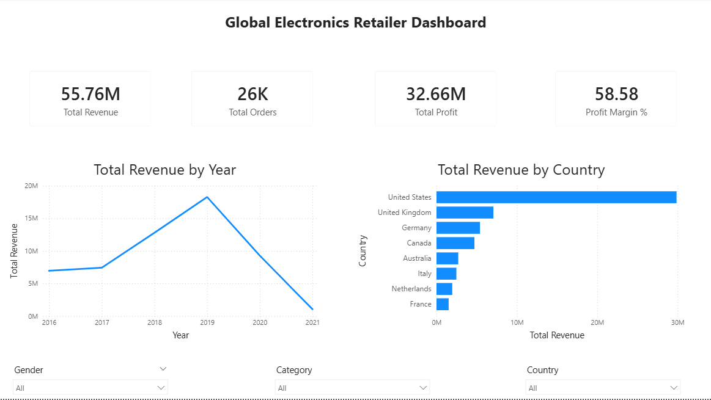
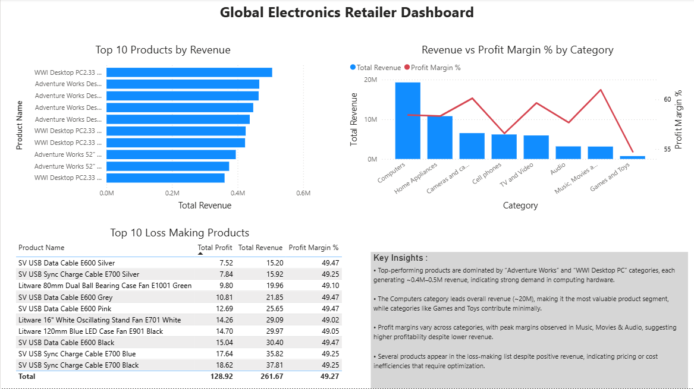
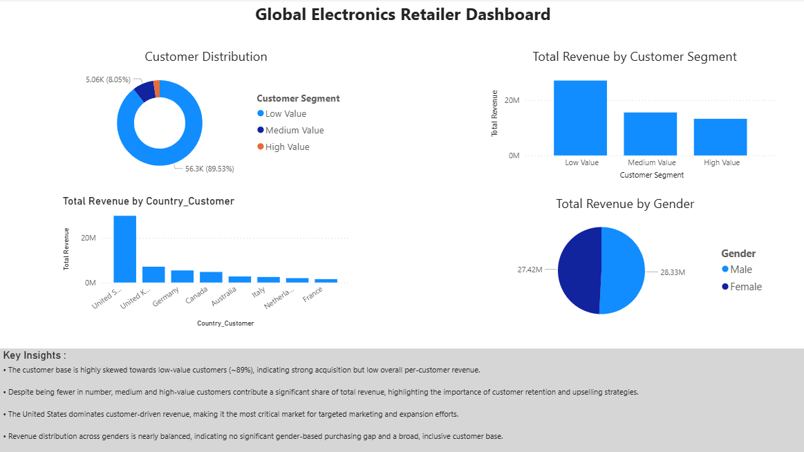
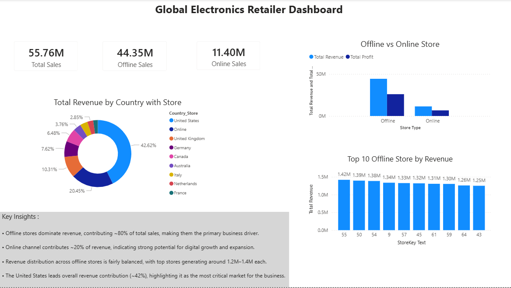

# 📊 Global Electronics Retailer Analysis

## 🚀 Project Overview
This project analyzes a global electronics retailer dataset to uncover insights across sales, customers, products, and store performance.

The goal was to transform raw transactional data into actionable business insights using data analysis and visualization techniques.

---

## 🛠️ Tech Stack
- Power BI (Dashboard & Visualization)
- Python (Pandas for data cleaning)
- Excel / CSV datasets

---

## 📂 Dataset
Dataset includes:
- Customers
- Sales Transactions
- Products
- Stores
- Exchange Rates

---

## 📊 Key Analysis Performed

### 🔹 Customer Analysis
- Customer segmentation (Low, Medium, High value)
- Revenue contribution by segment
- Country-wise customer revenue
- Gender-based revenue analysis

### 🔹 Product Analysis
- Top 10 products by revenue
- Category-wise revenue vs profit margin
- Identification of low-performing products

### 🔹 Store Analysis
- Top performing stores
- Offline vs Online revenue comparison
- Country-wise store performance

---

## 📈 Key Insights
- Offline stores contribute ~80% of total revenue
- A small number of products drive a large share of sales
- Majority customers are low-value but high-value customers drive revenue
- The United States is the top revenue-generating market

---

## 📸 Dashboard Preview

### 🔹 Overview

### 🔹 Product Analysis

### 🔹 Customer Analysis

### 🔹 Store Analysis

---

## 💡 Business Impact
This project demonstrates:
- Data cleaning and transformation
- KPI design and business thinking
- Dashboard storytelling
- Insight generation for decision-making

---

## 📌 Author
Jatin Sharma

